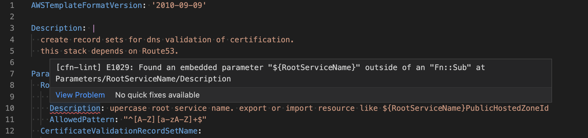
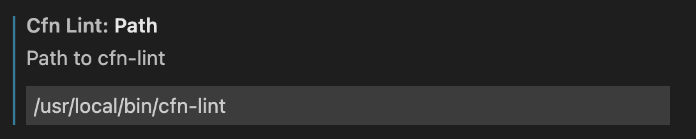

[cfn-lint](https://github.com/aws-cloudformation/cfn-lint)をインストールする
macOSを利用しているためbrewでインストールした

```shell
brew install cfn-lint
```

引数にCloudFormationを記述したファイルを指定して実行する

```shell
cfn-lint template.yaml
```

基本的にはファイルごとのコマンドラインの実行は行わず、後述するVisual Studio Code(vscode)の拡張機能を利用する

## vscodeでの利用

拡張機能を利用しエディタにシンタックスエラーを表示する



### CloudFormationの補完を有効にする

[拡張機能](https://marketplace.visualstudio.com/items?itemName=aws-scripting-guy.cform)をインストールする

### cfn-lintの拡張機能を有効にする

[拡張機能](https://marketplace.visualstudio.com/items?itemName=kddejong.vscode-cfn-lint)をインストールする

cfn-lintのpathを解決しないため[README](https://github.com/aws-cloudformation/aws-cfn-lint-visual-studio-code#extension-settings)を参考に設定

```shell
% which cfn-lint
/usr/local/bin/cfn-lint
```



### CloudFormationのタグを許可する

yamlのバリデーションがCloudFormationのタグをエラーにしてしまうため、カスタムタグを設定し許可する

```json
    "yaml.customTags": [
        "!Ref",
        "!Sub scalar",
        "!Sub sequence",
        "!Join sequence",
        "!FindInMap sequence",
        "!GetAtt scalar",
        "!GetAtt sequence",
        "!Base64 mapping",
        "!GetAZs",
        "!Select scalar",
        "!Select sequence",
        "!Split sequence",
        "!ImportValue",
        "!Condition",
        "!Equals sequence",
        "!And",
        "!If",
        "!Not",
        "!Or",
        "!And sequence",
        "!If sequence",
        "!Not sequence",
        "!Equals",
        "!Or sequence",
        "!FindInMap",
        "!Base64",
        "!Join",
        "!Cidr",
        "!Sub",
        "!GetAtt",
        "!ImportValue sequence",
        "!Select",
        "!Split"
    ],
```
