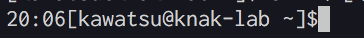

## 環境

- macOS
- bash

## 概要

プロンプトの表示を色々といじった時のメモ。

そもそもプロンプトとは何かというとシェルの入力行の先頭に表示される `username@MacBook-Pro ~ %` のような情報のこと。このプロンプトの表示を最終的に下の画像のようにプロンプトを変更した。


## 環境

- bash

## プロンプトを制御する環境変数

プロンプトは環境変数 `PS1` で定義されているので、環境変数を出力して確認。

```sh
% echo ${PS1}
[\u@\h \W]\$
```

デフォルトでは `[ユーザー名@ホスト名 現在のディレクトリ]` を表示するように定義されている。 `\u` がユーザー名、`\h`がホスト名、`\W`が現在のディレクトリを評価する特殊文字。

## 特殊文字

デフォルトの設定では、ユーザー名・ホスト名・現在のディレクトリを表示する特殊文字が利用されてたが、これらの特殊文字以外にも日付（`\d`）や時間（`\t`）の指定、ベルを鳴らす（`\a`）などがある。

[特殊文字の一覧](http://www.atmarkit.co.jp/flinux/rensai/linuxtips/002cngprmpt.html)

とりあえず、24時間をHH:MMの形式で表示する特殊文字を先頭に追加。

```bash
PS1='\A[\u@\h \W]\$'
```

先頭に現在時刻が表示される。



## エスケープシーケンスを利用する

[エスケープシーケンス](http://ascii-table.com/ansi-escape-sequences.php)を利用することで書体を太字や下線にしたり、文字の色を変更できる。グラフィック関数を呼び出すことで、次のグラフィック関数が呼び出されるまでの書式を指定できる。

>Esc[値;...;値m

書式は色と属性を組み合わせて指定する。色の指定は`31`のように2桁で行い、1文字目が`3`なら文字色の指定、`4`なら背景色の指定となる。

|code|色|
|:--|:--|
|0|黒|
|1|赤|
|2|緑|
|3|黄|
|4|青|
|5|紫|
|6|青緑|
|7|白|

文字色が赤なら`31`、背景色が赤なら`41`、文字色が緑で背景色が青の場合`31m;41m`となる。

文字の属性は1桁で指定する。

|code|属性|
|:--|:--|
|0|属性なし|
|1|太字|
|4|下線|
|5|点滅|
|7|反転|
|8|非表示|

エスケープの特殊文字は`\e`なので太字、文字色を黒、背景色を青にした場合は`\e[1;30;44m`となる。
これを適用すると `\e[1;30;44m[\u@\h \W]\$` となるが、色と属性の指定は次のグラフィック関数の呼び出しまで適用されてしまうので`\e[m`で色と属性の指定をデフォルトに戻す必要がある。

```bash
PS1='\e[1;30;44m[\u@\h \W]\$\e[m'
```

## 折り返しを正しく表示する
これまで、特殊文字の利用や色・属性の指定したが、現在の設定では入力が画面幅を超え折り返されたときに、改行が行われず現在の行を上書きしてしまう。


これはbashに「非表示文字を使用することを伝える特殊文」を利用していないために起こる。

|特殊文字|意味|
|:--|--|
| `\[` |非表示文字の開始|
| `\]` |非表示文字の終了|

この特殊文字を利用すると、先ほどのグラフィック関数の呼び出し`\e[1;30;44m`は`\[\e[1;30;44m\]`となる。同様に`\e[m`も`\[\e[m\]`となる。

## 環境変数に定義する

シェルを終了しても設定が反映されるように環境変数PS1を `~/.bash_profile` に定義する。

```~/.bash_profile
export PS1='\[\e[35m\]\u\[\e[m\]@\[\e[37m\]\h\[\e[m\] \[\e[1;34m\]\W\[\e[m\]\$'
```

最後に`~/.bash_profile`を読み込んで完了。

```bash
source ~/.bash_profile
```

覚えるのが辛いので、変数に置き換えた。

```~/.bash_profile
ESC="\[\e["
END="\]"
RES="\[\e[m\]"
OFF="0;"
BOLD="1;"
BLACK="30m"
RED="31m"
GREEN="32m"
YELLOW="33m"
BLUE="34m"
PURPLE="35m"
CYAN="36m"
WHITE="37m"
export PS1="${ESC}${PURPLE}${END}\u${RES}@${ESC}${WHITE}${END}\h${RES} ${ESC}${BOLD}${BLUE}${END}\W${RES}\$"
```

## 参考

- [特殊文字の一覧](http://www.atmarkit.co.jp/flinux/rensai/linuxtips/002cngprmpt.html)
- [ANSI Escape sequences](http://ascii-table.com/ansi-escape-sequences.php)
- [Controlling the Prompt](https://www.gnu.org/software/bash/manual/html_node/Controlling-the-Prompt.html)
