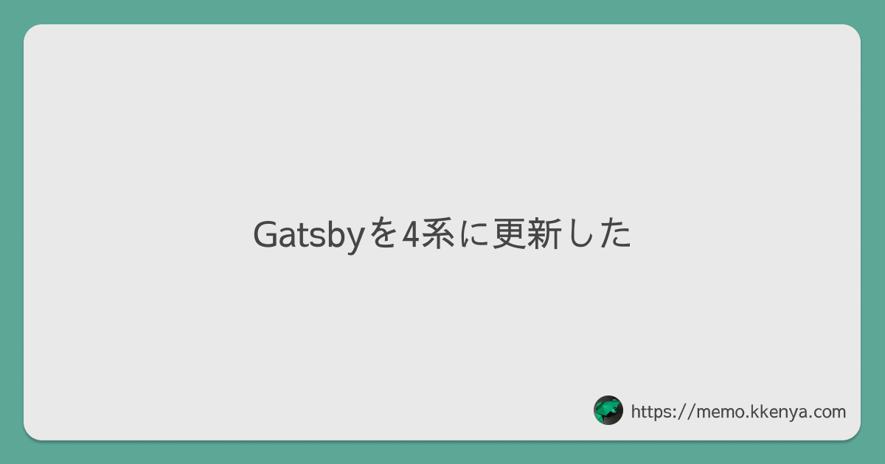
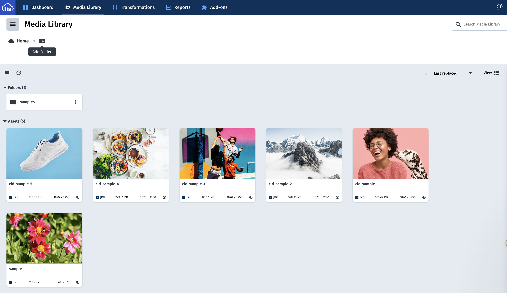
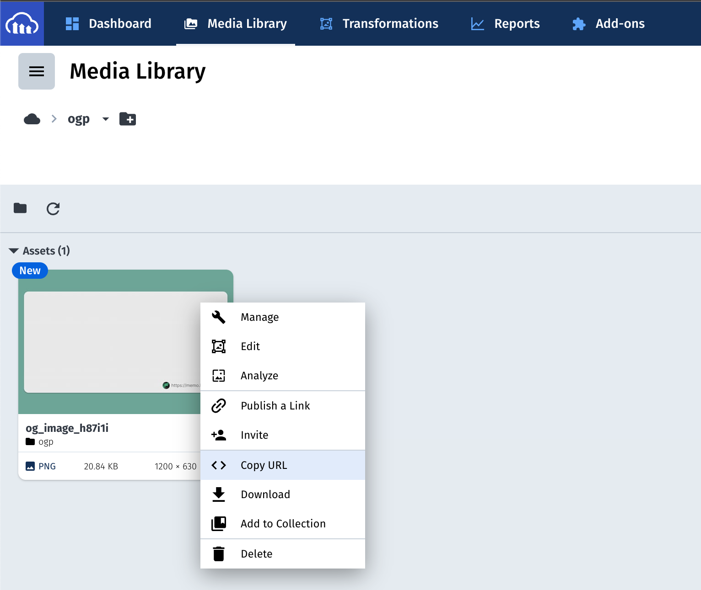

ブログのOG画像を動的に生成する方法はいくつかあるが、画像の合成や配信が可能なSaaSを利用することにより少ない手間で実現できる。今回は次の画像のようにテンプレート画像に記事ごとのタイトルをオーバーレイさせる画像を[Cloudinary](https://cloudinary.com/)で生成した。



## Cloudinary

画像、動画のアップロードから変換、最適化、CDNでの配信が可能なサービス。後述する画像変換のAPIを利用してOG画像を生成する。

## 無料枠

1ユーザー1アカウントで月25クレジットを利用できる。
クレジットはAPIやストレージの利用により消費される。
サインアップすれば無料枠を開始でき、クレジットカードの登録は必要ない。

- [PRICING](https://cloudinary.com/pricing)
- [Compare Plans](https://cloudinary.com/pricing/compare-plans)

### 1 Creditに対応するリソース

|対象|値|
|:--|:--|
transformations|100|
|マネージドストレージ|1GB|
|表示帯域幅|1GB|
|SD動画|500秒|
|HD動画|250秒|

## Cloudinaryの登録からOG画像の生成まで

### アカウント登録

email、pasword、国、サイト（オプショナル）の入力後に送信される確認メールからサインアップする。

### テンプレート画像を用意する

タイトルをオーバーレイさせるテンプレート画像を作成させる。OG画像のサイズは幅1200px、高さ630pxで作成した。

テンプレート画像の作成には何を利用してもいいが、今回は[Figma](https://www.figma.com/)で作成し、配色は[COOL COLORS](https://saruwakakun.com/design/gallery/palette)を参考にした。


## Cloudinaryにテンプレート画像をアップロードする

Media Libraryに移動し、テンプレート画像を格納するフォルダを作成する。



作成した画像をアップロード後、 画像のURLを取得する。



### Transformation URL APIでタイトルを合成する

テンプレート画像にタイトルをオーバーレイさせるには[Transformation URL API](https://cloudinary.com/documentation/transformation_reference)を利用する。

アセットのURLはメディアの種別やバージョンで構成される。 `transformations` の要素にフォントや色を指定することで画像を変換できる。

アップロードした画像は次のように `transformations` の指定がないURLを取得できる。

```text
https://res.cloudinary.com/my-cloud/image/upload/v1234567890/folder_name/image_name_h87i1i.png
```

|種別|値|
|:--|:--|
|cloud_name|my-cloud|
|asset_type|image|
|delivery_type|upload|
|transformations||
|version|v1234567890|
|public_id_full_path|folder_name/image_name_h87i1i|
|extention|png|

### transformationを指定したURL

後述する各パラメータを `,` で繋ぎ、 URLエンコードする。（エンコードはJavaScriptなら `(new URL('string')).toString()`）

```text
https://res.cloudinary.com/my-cloud/image/upload/l_text:Sawarabi%20Gothic_48:Gatsby%E3%82%924%E7%B3%BB%E3%81%AB%E6%9B%B4%E6%96%B0%E3%81%97%E3%81%9F,co_rgb:454545,w_1045,c_fit/v1234567890/ogp/image_name_h87i1i.png
```

### [テキストのオーバーレイ(l_text)](https://cloudinary.com/documentation/transformation_reference#l_layer)

　フォントとサイズが必須。下線やアライン、weightなどがオプショナルで指定できる。

|シンタックス|例|
|:--|:--|
|`l_text:<text style>:<text string>`|`l_text:Sawarabi Gothic_48:Gatsbyを4系に更新した`|

### [テキストカラー(co)](https://cloudinary.com/documentation/transformation_reference#co_color)

対応するtransformationの色を指定する。 `l_text` と併用することでオーバーレイしたテキストの色を変える。複数の方法で色を指定できる。

- 3桁のRGB
- 4桁のRGBA
- 6桁（16進数）のRBG
- 8桁（16進数）のRBGA
- buleなどの定義済みの色

|シンタックス|例|
|:--|:--|
|`co_<color value>`|`co_rgb:454545`|

### [テキスト幅(w)](https://cloudinary.com/documentation/transformation_reference#w_width)

アセット（transformationを含む）の色を指定する。指定する数値の型によってピクセル、倍数、原寸か判定される。

- ピクセルを指定した整数（150なら150px）
- 原寸に対する倍数（0.5なら半分）
- 原寸（`w_iw`）

|シンタックス|例|
|:--|:--|
|`w_<width value>`|`w_1045`|

### [テキストの折り返し(fit)](https://cloudinary.com/documentation/transformation_reference#c_fit)

width、heightと併用することで指定された幅・高さに収まるようにアセットを変換する。テキストに指定した場合は指定したwidthに収まるように改行される。

|シンタックス|例|
|:--|:--|
|`c_fit`|`c_fit`|

## 辛かった点

### 日本語対応したフォントが限られる

[フォントはGoogle Fontを利用できる](https://support.cloudinary.com/hc/en-us/articles/203352832-What-is-the-list-of-supported-fonts-for-text-overlay-transformation-)とあるが対応するフォントの一覧は提供されていない。日本語に対応したフォントを順にいくつか試したが、利用できたものは `Sawarabi Gothic` だった。

## 参考

- [Transformation URL API reference](https://cloudinary.com/documentation/transformation_reference#styling_parameters)
- [Image transformations](https://cloudinary.com/documentation/image_transformations#transformation_url_syntax)
- [What is the list of supported fonts for text overlay transformation?](https://support.cloudinary.com/hc/en-us/articles/203352832-What-is-the-list-of-supported-fonts-for-text-overlay-transformation-)
- [Cloudinaryで動的にOGP画像を生成する方法](https://catnose.me/notes/cloudinary-dynamic-ogp-image)
