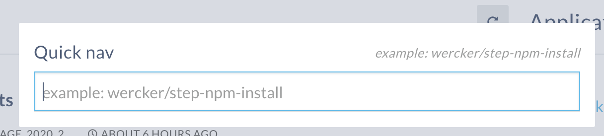
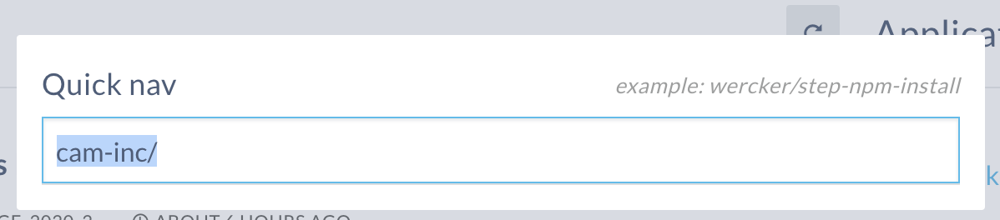
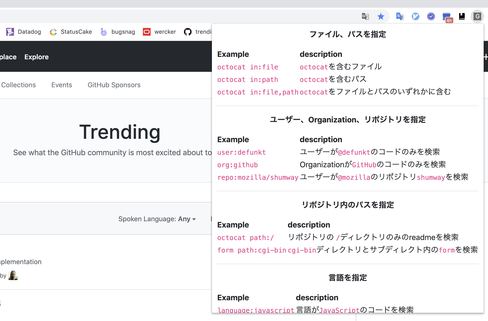

Chromeの拡張機能には日々お世話になっています。vimライクにブラウザを操作する[Vimium](https://chrome.google.com/webstore/detail/vimium/dbepggeogbaibhgnhhndojpepiihcmeb)やブラウザから簡単にリクエストを実行できる[Talend API Tester(旧Restlet　Client)](https://chrome.google.com/webstore/detail/talend-api-tester-free-ed/aejoelaoggembcahagimdiliamlcdmfm)などなど。

一見難易度の高く思える拡張機能も自分が使うだけの簡単なものなら直ぐにできたので紹介したい(**ストアへの公開は内容に含まれません**)

## inputに値を入力するだけの拡張機能を作る

はじめにHTMLの`input`タグの値に値を入力するだけの拡張機能をつくってみる。

自分の所属するプロジェクトではCIに[Wercker](https://www.oracle.com/corporate/acquisitions/wercker/)を使っている。
トップからショートカットの`w`を入力して表示されるQuick navからアプリケーションを検索できるのはすごい便利だけど、`Organization/application`の形式なので、毎回 `cam-inc/アプリケーション名` と入力するのがめんどくさい。これを予め入力されるようにする！



### 必要なファイル

今回利用するのは`manifestfile.json`, `index.js`の2つだけ

`manifestfile`は拡張機能の名前やバージョン、実行されるドメインや利用するファイルなどのメタ情報を定義する。

```json
{
  "name": "Wecker input",
  "version": "1.0.0",
  "manifest_version": 2,
  "description": "input organization name",
  "content_scripts": [
    {
      "matches": [
        "*://app.wercker.com/*"
      ],
      "js": [
        "index.js"
      ]
    }
  ]
}
```

manifestfileで指定している`index.js`はwerckerでショートカットを押したときに表示されるモーダルのinputを取得し、値を代入している。モーダルを閉じて開き直した場合に以前の入力が残らないように`focus`イベントごとに実行するよう指定

```js
const input = document.getElementsByTagName('input')[1]

input.addEventListener('focus', () => {
  input.value = 'cam-inc/';
});
```

作成した2つのファイルをGoogle Chromeの設定 > 拡張機能でデベロッパーモードを有効にし、`パッケージ化されていない拡張機能を読み込む`で指定することで利用できるようになる

[https://app.wercker.com/](https://app.wercker.com/)でquick viewを確認するとモーダルのinputに設定した値が入力されている



これでちょっと便利になった

## ポップアップの表示とショートカット

次はもう少し実用的な拡張機能としてポップアップとショートカットを実装する。
[GitHubの検索](https://help.github.com/en/github/searching-for-information-on-github/searching-code)は言語や拡張子、パスなどを指定して検索結果をフィルタリングできるが、いつも書き方を忘れるので、これを表示するポップアップをショートカットで表示できるようにする

今回のmanifestfileでは`browser_action`と`commands`プロパティを指定している。`browser_action`では検索バーの横に表示される拡張機能のアイコンをクリックしたときのポップアップを指定、`commands`ではキーバインドを指定している。`commands`の指定では必ず、`Ctrl`か`Alt`の指定が必要なので、vimiumのような柔軟な設定をするには別の仕組みが必要になる。

```json
{
  "name": "GitHubSearchHelper",
  "version": "1.0.0",
  "manifest_version": 2,
  "description": "Show GitHub search qualifiers",
  "browser_action": {
    "default_popup": "popup.html"
  },
  "commands": {
    "_execute_browser_action": {
      "suggested_key": {
        "default": "Ctrl+Shift+E"
      },
      "description": "toggle help modal"
    }
  },
  "content_scripts": [
    {
      "matches": [
        "*://*.github.com/*"
      ]
    }
  ]
}
```

ポップアップに表示するHTMLファイルは[marked](https://github.com/markedjs/marked)を利用して生成した

拡張機能を読み込んで指定したショートカットを実行するとポップアップが表示される



スタイルを殆ど書いてないので見た目は悪いけど、動作は確認できたのでヨシ!

## 参考

- [GoogleChromeドキュメント](https://developer.chrome.com/extensions/devguide)
