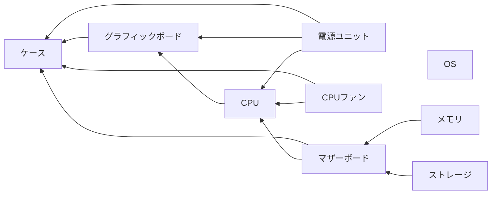

デスクトップPCを組む

作者
- PC組むの初めて

知識として知っておきたい
どうせなら見た目にこだわりたい
ので作成

スペック・見た目を決める

やりたことから必要なスペックを割り出す
予算の範囲内で、できるだけ希望の性能に近づけるように

- スペック
	- 負荷の高い3DCGのゲームを高い画質でできる（ゲーミングPC）
	- プログラミングもできる
- 見た目
	- 白
	- 光る

## 必要な部品

- マザーボード
- CPU
- メインメモリー
- グラフィックボード
- CPUクーラー
- ストレージ
- 電源ユニット
- ケース
- ケースファン
- OS

## チャート

## グラフィックボード

搭載されたGPU(Graphics Processing Unit)により画像処理を行い、モニターに表示する
3DCGの描画や動画編集など負荷の高い映像処理を行う場合に必要

グラフィックボードが必要な場合
ゲームの3DCGや動画編集など負荷の高い映像処理
CPUやマザーボードにグラフィックボードを内蔵していない
仮想通貨のマイニングのような高度な計算処理

グラフィック描画の負荷が高い3DCGゲームをするなら高性能なものが必須!

やりたいゲームの推奨スペックから考える

サイバーパンク参考

## CPU(Central Processing Unit)

主なCPUメーカー
intel AMD

世代が大きいほど、性能が高くなる
グレードが上がれば、コア数、スレッド数も大きくなる

基本的に世代が大きくなるほど性能も高くなるが、価格は上がる

グラフィックボードの性能と比較してCPUがボトルネックにならないように
ゲームを目的にするならコア数はそんなに必要ない

コスパ = PassMarkやCinebenchなどのベンチマークサイトのスコア / 価格

## ケース

大きさによって取り付けるマザーボードの規格(フォームファクタ)が決まる

## マザーボード

CPUを決めたことによってチップセットが決まる
ケースのサイズを決めたことで規格(フォームファクタ)が決まる
※ 例えば
Ryzen 7 5800Xに対応するチップセットはB550
ケースがATX以下対応

価格が高いほど、端子の種類と数が多くなる

## メモリ

マザーボードを決めたことによって規格が決まる
DDR4
DDR5

※ 例えば
チップセットB550に対応する規格はDDR4

上面にRGB LEDを搭載したモデルもある
マザーボードがデュアルチャネルに対応しているなら２枚

## CPUファン

快適な動作を継続するためにはCPUにあったCPUクーラーを選ぶ必要がある
CPUの温度が上がりすぎると処理性能を一定温度まで下げる「サーマルスロットリング」

空冷
簡易空冷

ハイエンドなCPUを利用しない限り空冷・水冷どちらでも可

見た目で選んだ！

## エアフロー

煙突排気

## ストレージ

SDD or HDD
マザーボードを決めたことによって規格が決まる
M.2
PCI-Express Gen4

読込速度、書込速度
「MTBF」（平均故障間隔）
動作時間の合計÷故障発生数

## OS

OS

ゲームをするならWindows

## 組み立て

※ 人によって順番が異なります

マザーボードにCPU、メモリ、SSDを取り付けていく

CPUの取り付け

向きを合わせて２枚取り付け

ヒートシンクを外す

M.2 SSDの取り付け

ヒートシンクを戻す

PCケースにマザーボードを取り付け

マザーボードをネジで固定

CPUクーラーの取り付け

グラフィックボードの取り付け

電源ユニットの取り付け
マザーボード
グラフィックボード
CPUクーラー
ケースファン

動作確認
Windowsインストール

ショップでの購入や、BTOでも同じくらいの価格で購入できる！
「自作PC = 安く作るではない」が趣味として楽しい

|パーツ|製品|価格|リンク|
|:--|:--|:--|:--|
|マザーボード|ASRock B550 Steel Legend|¥21,000.00|https://www.asrock.com/mb/AMD/B550%20Steel%20Legend/index.jp.asp|
|CPU|Ryzen 7 5800X BOX|¥28,140.00|https://www.amd.com/ja/products/cpu/amd-ryzen-7-5800x|
|メインメモリー|DDR4 2x16GB PC4-25600 (3200MHz).|¥10,410.00|https://www.corsair.com/ja/ja/%E3%82%AB%E3%83%86%E3%82%B4%E3%83%AA%E3%83%BC/%E8%A3%BD%E5%93%81/%E3%83%A1%E3%83%A2%E3%83%AA/Vengeance-PRO-RGB-White/p/CMW32GX4M2E3200C16W#tab-tech-specs|
|グラフィックボード|Palit GeForce RTX™ 3080 GamingPro OC|¥99,800.00|https://www.palit.com/palit/vgapro.php?id=3763&lang=jp&pn=NED3080S19IA-132AA&tab=sp|
|CPUクーラー|MSI MAG CORELIQUID 240R V2 WHITE|¥14,400.00|https://jp.msi.com/Liquid-Cooling/MAG-CORELIQUID-240R-V2-WHITE|
|ストレージ|SSD 1TB PCIe Gen4 NVMe|¥15,901.00|https://www.cfd.co.jp/biz/product/detail/cssd-m2m1tpg4nzl.html|
|電源ユニット|DEEPCOOL PQ750M R-PQ750M-FA0B-JP (750W)|¥11,980.00|https://jp.deepcool.com/products/PowerSupplyUnits/powersupplyunits/PQ750M-80-PLUS-Gold-Modular-Power-Supply/2021/14051.shtml|
|ケース|corsair iCUE 4000X RGB|¥18,530.00|iCUE 4000X RGB 強化ガラス製ミドルタワー ATX ケース - ホワイト|
|OS|Windows11 Home|¥15,680.00|https://www.amazon.co.jp/dp/B09WHSYQBB/?tag=madeinpc-22|
|合計||¥235,841.00||

## tips

タイムセールで買うと良い

1117

## CyberPunk 2077

- [cyberpunk 2077](https://support.cdprojektred.com/ja/cyberpunk/pc/sp-technical/issue/1556/saibapanku2077-nobi-yao-dong-zuo-huan-jing)

## CPU

AMDかIntel

### AMD

数字が大きいほど性能の高くなる。先頭の数字はCPUの世代を表し、世代が大きいほどアーキテクチャが異なりパフォーマンスが高くなる。

Ryzen
Zenアーキテクチャ採用したCPU

- Ryzen 9
- Ryzen 7
- Ryzen 5
- Ryzen 3

7950Xを例にすると、第7世代でマイナーバージョンが950、XはExtreme(最高峰)を表す。

|アルファベット|説明|
|:--|:--|
|なし|通常盤|
|X(Extreme)|高性能版|
|G(Graphic)/GE|GPU内蔵APU|
|E|ラップトップ用低消費電力|
|H|ラップトップ用デフォルトCPU/TPU45W|
|HX|ラップトップ用オーバークロッ|
|HS|ラップトップ薄型軽量モデル向け　省電力TPU35W|
|U|ラップトップ用低消費電力CPU/TPU15W|

グラフィックの機能はグラフィックボードを購入するので不要

CPUの性能比較ではPSSMARKの値を目安にすると良い

Ryzen 5000シリーズ
第4世代Zen3

Zen|第1世代
Zen+|第2世代
Zen2|第3世代
Zen3|第4世代
Zen4|第5世代

### コア数

### スレッド数

### 動作周波数（GHz)

1秒秒あたりのCPU処理回数

### 開発世代

アーキテクチャはZen1, Zen2, Zen3と世代を重ねている。
新しい世代の方が1コア、1GHzあたりの性能が高くなる

## マザーボード

フォームファクター(形状)によって規格が異なる

|規格|ATX|MicroATX|Mini-ITX|E-ATX|
|:--|:--|:--|:--|:--|
|名称|Advanced Technology eXtended|Micro Advanced Technology eXtended|Mini Integrated Technology eXtended|Extended-ATX|
|サイズ|244mm×305mm|244mm×244mm|170mm×170mm|305mm×330mm|
|拡張スロット数|最大7基|最大4基|最大1基|最大7基
|メモリスロット数|4基～8基|2基～4基|1基～2基|4基～8基|

### チップセット

マザーボードの搭載された集積回路
CPUやメモリー、グラフィックボードなどのデータ受け渡しを管理する
チップセットによって対応するメモリー、メモリの世代が決まる

プレフィックスによって性能が分かれる。

|プレフィックス|説明|
|:--|:--|
|X|最上位帯(ハイエンド)|
|B|廉価版(ミドルクラス)|
|A|低価格帯(ローエンド)|

- X570
- B550
- A520
- X470
- B450
- X370
- B350
- A320

X570, B550は両方ともPCI Express 4.0に対応したSocket AM4向けのチップセット

- B550
  - 第3世代Ryzen以降
- X570
  - 第2～3世代のRyzen, Ryzen APU

PCI Expressのレーン数と世代

- B550
- CPU内蔵のPCI Express 4.0のみ(=CPU直結のみ)
- チップセット内蔵のPCI Expressは3.0世代
  - チップセット接続のM.2スロットや拡張スロットはPCI Express 3.0しか利用できない

リリース

- B550
- 第3世代Ryzenの登場から約1年を経てリリースされた

PCI Express 4.0はNVMe Gen4 SSDを接続できる
Gen4 4GB/Sec
Gen3 3GB/Sec

### PCI Express

拡張スロットの接続規格
世代によって転送速度が異なり、大きいほど早くなる

PCIe 4.0 16GBbps
PCIe 3.0 8GBbps

### VRMフェーズ数

CPU用の電源回路の数
フェーズ数が多いほど安定する
Ryzen9(10コア)以上では12フェーズ以上
Ryzen7(8コア)以下で8フェーズ

VRMにもヒートシンクが設置されていることがあり、オーバークロックを行うなどハイエンドなものほどヒートシンクがしっかりしている

### ソケット

AMDはAM4のみ

### メモリスロット数

2つでも困らなさそう

### 無線LAN

不要

### ソケット

マザーボードのCPUを取り付ける箇所をCPUソケットという

## グラフィックボード(GPU)

## メインメモリ(RAM)

一次記憶装置、RAM(Read Only Memory)

### DDR(Double Data Rate)

DDRはメモリの規格の一つでDDR-SDRAM(Synchronous Dynamic Random Access Memory)を省略した名称。
SDR(Single Data Rate)メモリは、一回のクロック信号で一回データを転送する。大して、DDRは一回のクロック信号で二回データを転送する。

DDR3とDDR4では互換性がない。(ピンの数が異なる DDR3: 240, DDR4: 288)

#### フォームファクター

メモリモジュールの形状に関するスペック
デスクトップ向け: DIMM
ラップトップ向け: SODIMM

メモリモジュールの違い
レジスタード(Registered)メモリ(RDIMM): サーバーワークステーション向け
アンバッファード(Unbuffered)メモリ(UDIMM): 自作PCではほぼこれ

### メモリクロック

メモリのスペックを表す。「DDR4-3200」ならDDR4が規格を示し、3200がデータ転送レートを示す。単位はMHz(メガヘルツ)で表され、3200MHzなら1秒間に32億回のデータを転送できる。

メモリクロックはデータの転送レートであり、DDRが一回のクロック信号で二回データを転送できるためクロック信号はデータ転送の半分となる。

### メモリ帯域幅

一秒間転送可能なデータ容量を示すスペック。「PC4-25600」ならPC4が規格を示し、25600が帯域幅を示す。PC4ならDDR4、PC3ならDDR3となる。帯域幅の単位はMB/s(メガバイト毎秒)で表され、2560025600MB/sとなる。

## CPUクーラー

## 電源ユニット

基本的に利用されるサイズの規格にはATXとSFXがある

### モジューラケーブル

ケーブルが電源ユニットから着脱できる。不要なケーブルを外すことができるが、端子が本体から出るので奥行きが大きくなる。

### セミモジューラ

## ストレージ

### PCIe(PCI Express)

拡張スロットの接続規格。世代、レーン数によって転送速度が異なる。

### M.2

NVMe、SATAともにサポートされているフォームファクター(形状)。M.2のSSDをM.2 SSDと呼ぶ。M.2はSerial ATAやPCI Expressなどの従来のインターフェース規格に対応している。ストレージに利用される端子にはB KeyとM Key、B&M Keyの3種類。

### NVMe接続(Non-Volatile Memory Express)

フラッシュメモリの通信を最適化するための通信プロトコル。PCI Express接続を用いており、SSD側に搭載されているNVMeコントローラーが高速なデータ転送を実現する。SATA規格よりも規格よりも高速にデータを転送できる。

## PCケース

ケースによって対応するマザーボードの規格が異なる

- タワー型
- スリム型
microATXやMini-ITX対応の製品が多い
拡張性に制約がある
- キューブ型
立方体に近い
Mini-ITX

タワー型はさらに三つに分類される

フルタワー
特に大きなもの
ミドルタワー
一般的なサイズ
ミニタワー
microATXに対応しているもの

拡張性
エアフロー

### ドライブベイ

2.5インチ
SSD
3.5インチ
HDD
5.25インチ
光学式ドライブ

## 総評

processer|price
:--|:--
Ryzen 9 7950X|¥81,499
Ryzen 7 7700X|¥50,708

|製品|製品|価格(K)|
|:--|:--|:--|
|MB(Mother Board)|[MPG B550 GAMING PLUS](https://jp.msi.com/Motherboard/MPG-B550-GAMING-PLUS/Specification)|21|
|CPU|[Ryzen 7 5700X BOX](https://kakaku.com/item/K0001429753/)|29|
|Memory|[DDR4 2x16GB PC4-25600 (3200MHz)](https://www.corsair.com/ja/ja/%E3%82%AB%E3%83%86%E3%82%B4%E3%83%AA%E3%83%BC/%E8%A3%BD%E5%93%81/%E3%83%A1%E3%83%A2%E3%83%AA/Vengeance-PRO-RGB-White/p/CMW32GX4M2E3200C16W#tab-tech-specs)|10|
|グラフィックボード||150|
|CPUクーラー||25|
|ストレージ|[SSD 1TB PCIe Gen4](https://www.amazon.co.jp/dp/B0B1ZRZDDF/?tag=madeinpc-22&th=1)|16|
|電源ユニット||20|
|ケース|[ミドルタワー](https://www.amazon.co.jp/dp/B09CW354GD/?tag=madeinpc-22)|11|
|OS|[Windows11 Home](https://www.amazon.co.jp/dp/B09WHSYQBB/?tag=madeinpc-22)|18|

|CPUグリス|||
マウス
キーボード

## 参考

- マザーボード
  - [ASUS](https://www.asus.com/jp/motherboards-components/motherboards/all-series/)
  - [MSI](https://cybersocean.net/msimothcom/)
  - [ASRock](https://4chunks.com/asrock-b550/)
- [見れば全部わかるDDR4メモリ完全ガイド、規格からレイテンシ、本当の速さまで再確認](https://akiba-pc.watch.impress.co.jp/docs/sp/1231939.html)
- [メモリ基本講座「NVMe とは何ぞや」](https://www.paltek.co.jp/techblog/techinfo/220218_01)
