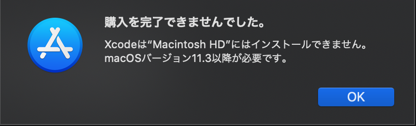

## 前提

macOS Catalinaで `node-gyp` インストール時に `gyp: No Xcode or CLT version detected!` でエラーとなった。これはmacOS Catalinaを利用している場合のみの現象らしくOSアップグレードで回避できそうだが、業務で利用しているソフトウェアの都合上現在の環境で対応したい。

## 環境

- macOS Catalina バージョン 10.15.7

## 結論

xcodeの再インストールを行う。対応を `node-gyp` の[リポジトリでまとめてくれている](https://github.com/nodejs/node-gyp/blob/master/macOS_Catalina.md#the-acid-test)ので書いてある通りに対応すれば問題なかった

```sh
sudo rm -rf $(xcode-select -print-path)
sudo xcode-select --reset
xcode-select --install
```

[スクリプトを実行](https://github.com/nodejs/node-gyp/blob/master/macOS_Catalina.md#the-acid-test)して確認

```sh
curl -sL https://github.com/nodejs/node-gyp/raw/master/macOS_Catalina_acid_test.sh | bash
```

xcodeの再インストールをしてもエラーになる場合は[I did all that and the acid test still does not pass :-(](https://github.com/nodejs/node-gyp/blob/master/macOS_Catalina.md#i-did-all-that-and-the-acid-test-still-does-not-pass--)6の以降を試す

## 原因

ドキュメントにある通り、カタリナへのアップグレードとカタリナでのソフトウェアアップデートで `node-gyp` のインストールに失敗するとのこと。

>Both upgrading to macOS Catalina and running a Software Update in Catalina may cause normal node-gyp installations to fail.

## 対応したログ

xcodeのインストールを実行したが、インストール済みと表示される

```sh
% xcode-select --install

xcode-select: error: command line tools are already installed, use "Software Update" to install updates
```

rootユーザーでxcodeんをリセットしてインストールし直す

```sh
% xcode-select --reset
xcode-select: error: --reset must be run as root (e.g. `sudo xcode-select --reset`).
% sudo xcode-select --reset
```

## 試したが有効ではなかった

```sh
% xcodebuild --version
xcode-select: error: tool 'xcodebuild' requires Xcode, but active developer directory '/Library/Developer/CommandLineTools' is a command line tools instance
```

AppStoreでxcodeのインストールしようとするが、カタリナではできない



node-gypのグローバルインストールは成功するが、xcode自体が見つからない問題は解決できない

```sh
% npm install -g node-gyp
/Users/s06540/.nvm/versions/node/v14.17.6/bin/node-gyp -> /Users/s06540/.nvm/versions/node/v14.17.6/lib/node_modules/node-gyp/bin/node-gyp.js
+ node-gyp@8.2.0
added 93 packages from 33 contributors in 19.568s
% curl -sL https://github.com/nodejs/node-gyp/raw/master/macOS_Catalina_acid_test.sh | bash

Command Line Tools not found
```
