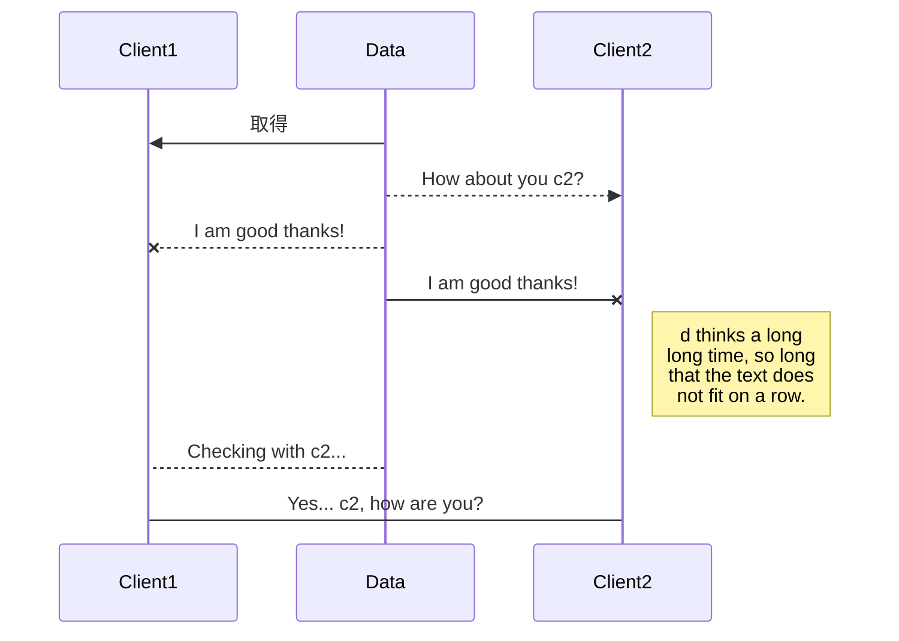

在庫30
client a 5個購入30 - 5 = 25
client b 10個購入30 - 10 = 20
client aが5個購入しているのでb購入後は15になっているはずだが、不整合発生

## 排他制御

- 楽観ロック（楽観的排他制御）
- 悲観ロック（悲観的排他制御）

### 楽観ロック(optimistic locking)

滅多に起こらないことを前提としたロック

データそのものに対してはロックを行わない
更新対象のデータががデータ取得時と同じ状態であるあことを確認することで生合成を担保する
データをversion管理し、更新時にバージョンを更新する。取得時のバージョンと更新時のバージョンが同じか確認する
データがが取得時と更新時で同じであることを判断するための値を**ロックキー**と呼ぶ
頻繁に更新され、取得から更新までの処理時間が長いデータには不向き

### 悲観ロック(pessimistic locking)

頻繁にデータを更新することを全体にしたロック

データ取得時にロックをかけ、他のトランザクションから更新されないようにする。トランザクション開始時にロックを取得し、ロックされたデータはトランザクションがコミットまたはロールバックされるまで他のトランザクションから更新できない

データ更新後は確実にロックを解除する必要がある

- 共有ロック
- 排他ロック（占有ロック）

デッドロック

分散ロック（Distributed Lock)

## 参考

https://qiita.com/NagaokaKenichi/items/73040df85b7bd4e9ecfc
