## 背景

publicなリポジトリならSonarCloudによる静的解析を無料で利用できるので試してみた。

## 環境

- GitHub
- TypeScript(JavaScript)
- Jest
- Visual Studio Code

## Sonar

コードの静的解析ツール。20以上の言語に対応しており、保守性や脆弱性に影響を及ぼす可能性のあるコードを報告してくれる。また、次の3つのプロダクトを提供する。

|Product|説明|
|:--|:--|
|SonarLint|ローカル開発でのリアルタイムの静的解析|
|SonarQube|自前でサーバーをホスティングして利用する静的解析ツール|
|SonarCloud|GitHubやBitBucketと連携して静的解析できるSaaS|

## SonarCloud

オープンソースのプロジェクトなら無料で利用できる。（設定時にFree Planを選択できる）。Pull Request作成時にCIと連携することやメインブランチなどの自動解析が可能。

### SonarCloudが検出するもの

**Issues** と **Security Hotspots** に分類される。IssuesはさらにCode Smells、Bugs、Vulnerabilitiesに分類される。

#### Code Smells

保守性(maintainability)に影響を及ぼす可能性のあるコードの特徴を検出する。

例: 上位のスコープで定義された変数を下位のスコープで再定義する

```js
const foo = 'value'
arr.map(foo => {
  // ...
})
```

#### Bugs

信頼性(reliability)に影響を及ぼす可能性のあるコードを検出する。

例: 引数の上書き

```js
const func => (foo, bar) => {
  // bug!
  foo = 'overwrite'
}
```

#### Vulnerabilities

セキュリティ(security)に影響を及ぼす可能性のある脆弱性を検出する。

例: 脆弱性の報告されている暗号化方式を利用している

### Security Hotspots

脆弱性やバグを特定するときよりも基準は厳格でないが、問題を引き起こす可能性のあるコードを警告する(security review)。

## やったこと

1. SonarCloudのアカウント作成
2. 解析対象の連携（今回はGitHub）
3. SonarCloudへリポジトリのインポート
    - Organizationか個人アカウントを一括でインポートできる
    - 今回は設定するリポジトリのみを指定
4. 設定ファイルの追加
5. [オプショナル]sonarLintの導入

### セットアップ

GitHubを選択。

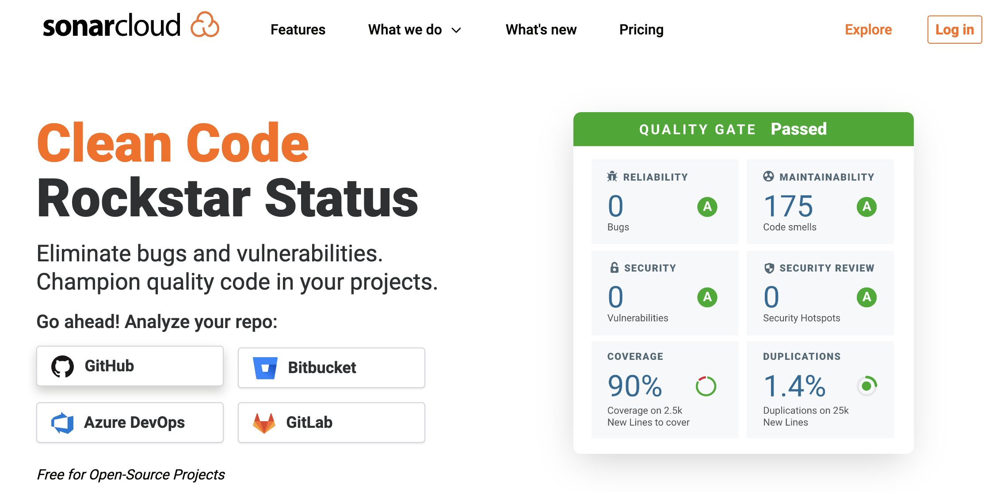

Analyze new projectを選択。

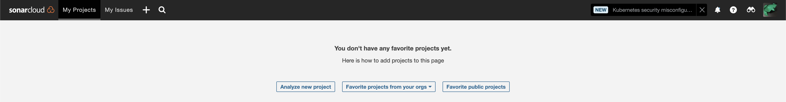

始めての利用なのでOrganizationの作成と対象のリポジトリを選択する。

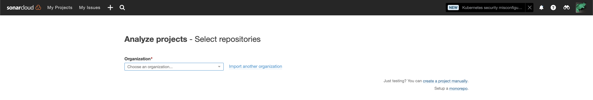

Organazationの設定

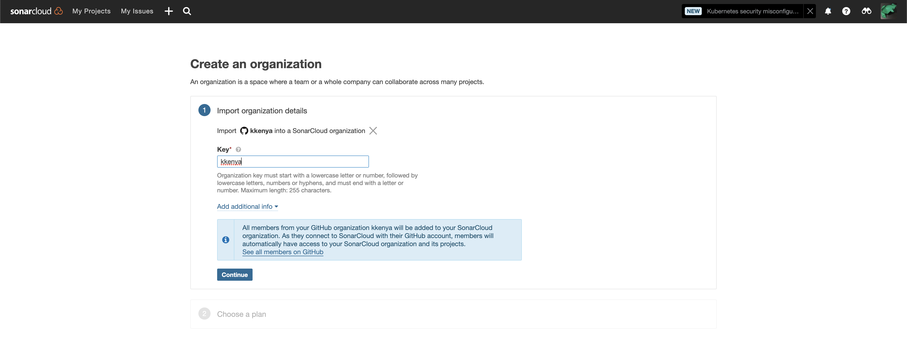

Publicなリポジトリなので無料プランを選択できる。

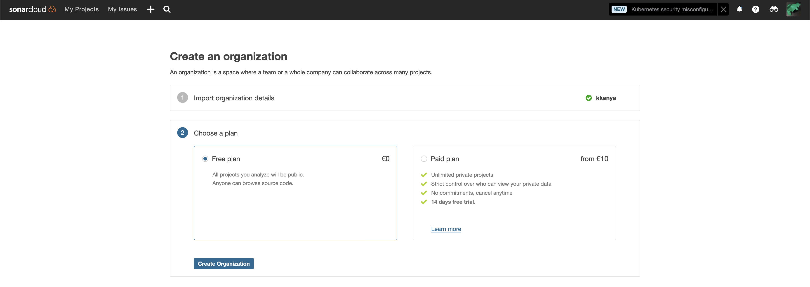

作成したプロジェクトを選択してセットアップ。

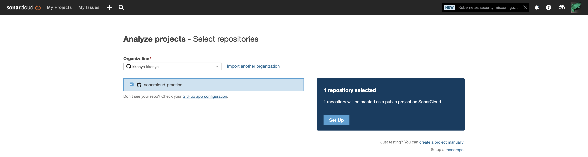

## Quality Gate

Quality Gateは現在のコードがリリースに値するかの指標を提供する。解析にはコード全体に適用される条件と新しいコードに適用される条件を区別し、新しいコードの解析結果から測定される。

Sonar Way: Built-in
Example QG: custom-defined

### New Code

[New Code](https://docs.sonarcloud.io/improving/new-code-definition/)を定義することで、SonarCloudが新しく追加されたメインブランチへの変更を分析できる。

New Codeの定義はAdministrator → New Codeで次の3つから選択する。

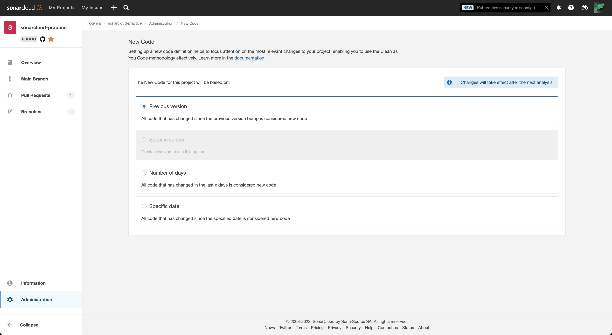

#### Previous version

前回のバージョンからの変更をNew Codeとする。Maven・Gradle以外のバージョンは自動でバージョン変更を読み取ることはできず、 `sonar.projectVersion` を明示的に指定する。

#### Number of days

指定日数までの変更をNew Codeとする。

#### Specific date

指定した年月日以降の変更をNew Codeとする。

### Quarity Gateの有効化

Administration → Quality Gatesから設定する。デフォルトでは定義済みのSonary Wayが適用されている。

New Codeの定義後にSonarCloudの解析を再度実施するとOverviewの「Main Branch Status」が更新される。

## CI-based Analysis

CI-based AnalysisはPull Requestごとに変更のあったコードのみを対象とした静的解析。

GitHubのリポジトリをセットアップ後は[Automatic Analysis](https://docs.sonarcloud.io/advanced-setup/automatic-analysis/)が自動で有効となる。Automatic Analysisは自動でPull Request、メインブランチの静的解析を行うが、CI-based Analysisと併用できないため無効にする（変更には管理者権限が必要）。


GitHub Actionsの手順に従い、設定する。

### 1. GitHubへトークンの登録

SonarCloudから指定されたトークンをGitHubの Settings → Secretsで `SONAR_TOKEN` を登録する。

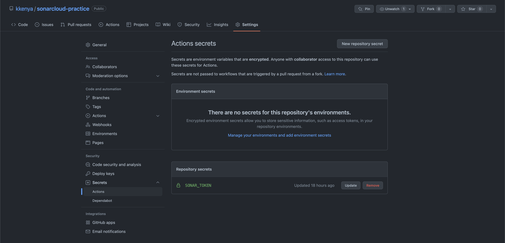

### 2. GitHub Actionsの設定

リポジトリにGitHub Actionsの設定ファイル `.github/workflows/build.yml` を追加する。

```yaml
name: Build
on:
  push:
    branches:
      - main # PRマージ先のブランチを設定する
  pull_request:
    types: [opened, synchronize, reopened]
jobs:
  sonarcloud:
    name: SonarCloud
    runs-on: ubuntu-latest
    steps:
      - uses: actions/checkout@v2
        with:
          fetch-depth: 0 # Shallow clones should be disabled for a better relevancy of analysis
      - name: SonarCloud Scan
        uses: SonarSource/sonarcloud-github-action@master
        env:
          GITHUB_TOKEN: ${{ secrets.GITHUB_TOKEN }} # Needed to get PR information, if any
          SONAR_TOKEN: ${{ secrets.SONAR_TOKEN }}
```

リポジトリにSonarCloudの設定ファイル `sonar-project.properties` を追加する。

```conf
sonar.projectKey=kkenya_sonarcloud-practice
sonar.organization=kkenya

sonar.sources=src
sonar.tests=__tests__
sonar.typescript.tsconfigPath=tsconfig.json
```

|key|value|
|:--|:--|
|sonar.sources | コード全体のパスを指定|
|sonar.tests|テストコードのパスを指定|
|sonar.typescript.tsconfigPath|tsconfig.jsonのパスを指定|

言語ごとの設定項目はAdministrator → General Settingsから確認できる。

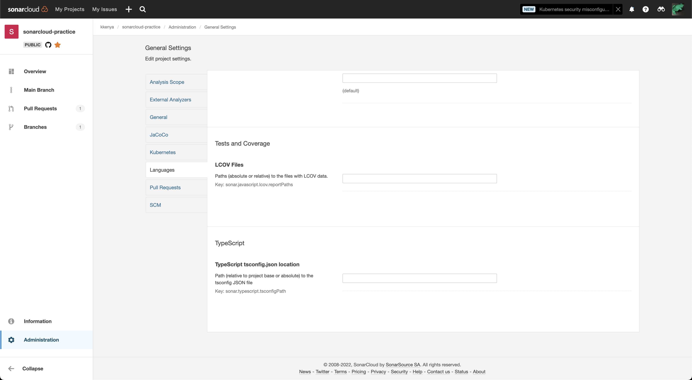

## テストカバレッジの計測

カバレッジの計測はAutomatic Analysisでサポートされていない（[javascript-typescript-test-coverage](https://docs.sonarcloud.io/enriching/test-coverage/javascript-typescript-test-coverage/)）。別途CI-based Analysisを設定する。

カバレッジ計測の条件はCIの実行時にレポートファイルをLCOV形式で出力し、SonarCloudのスキャナーが取得できること。

SonarCloudの解析前に、Jestでカバレッジレポートを生成するステップをGitHub Actionsに追加する。

`.github/workflows/build.yml`

```diff
       - uses: actions/checkout@v2
         with:
           fetch-depth: 0 # Shallow clones should be disabled for a better relevancy of analysis
+      - name: Install dependencies
+        run: npm install --include=dev
+      - name: Test and coverage
+        run: npm test
       - name: SonarCloud Scan
         uses: SonarSource/sonarcloud-github-action@master
         env:
```

SonarCloudにカバレッジリポートのパスを指定する。Jestは `./coverage/lcov.info` に計測結果を出力する。

`sonar-project.properties`

```conf
sonar.javascript.lcov.reportPaths=./coverage/lcov.info
```

正しく設定できれば、Pull Requestに解析結果が報告される。

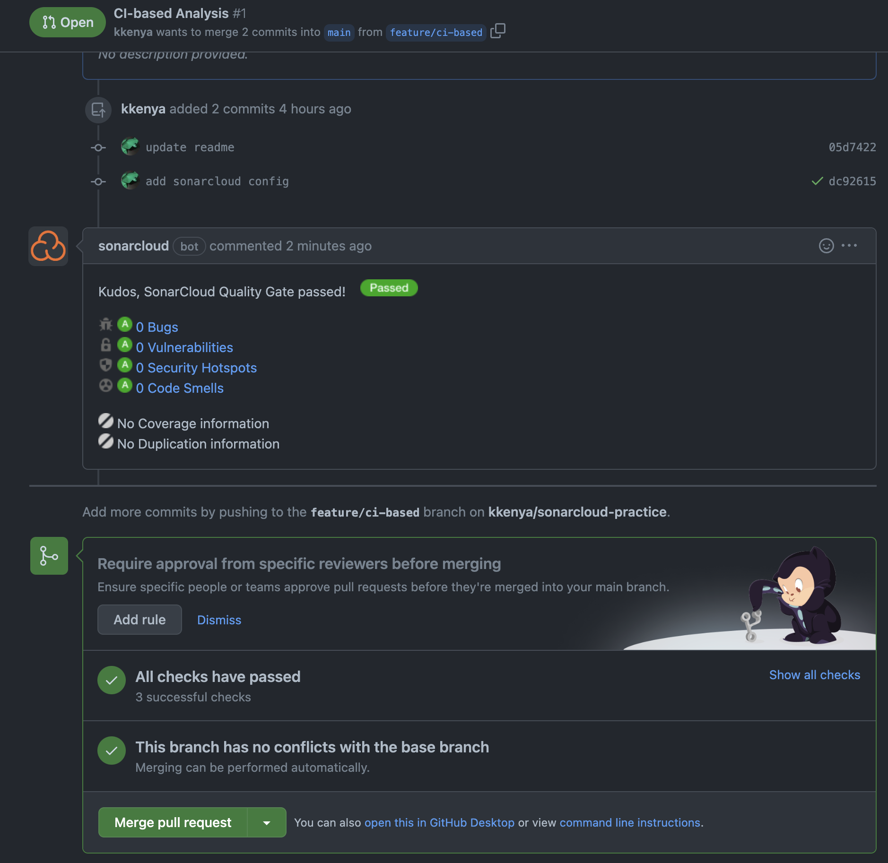

## Badges

SonarCloudのInformationからREADMEで表示するためのバッジを取得できる。バッジのメトリクスにはQuality Gateのステータス、VulnerabilitiesやCoverageなどから選択する。

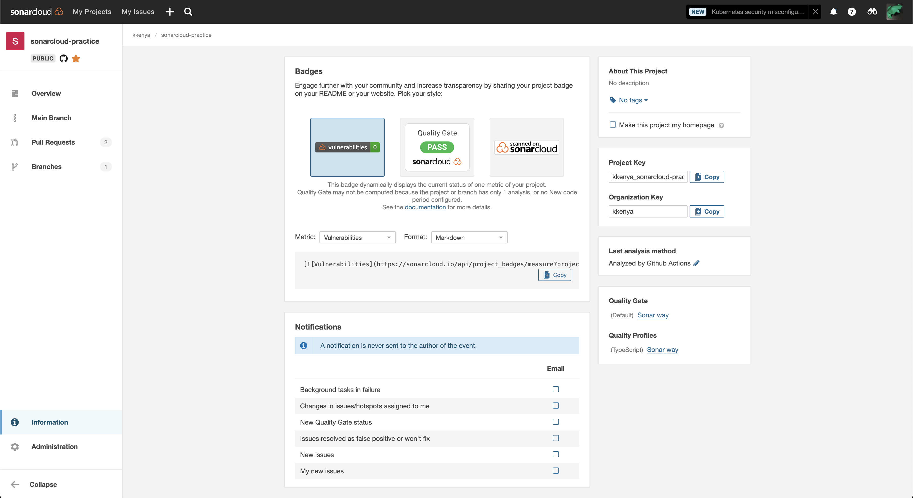

[](https://sonarcloud.io/summary/new_code?id=kkenya_sonarcloud-practice)

## SonarLintの導入

開発時にロー買うのコードに対してSonarCloudの解析を実施できる。

複数のエディタに拡張機能が提供されており、今回は[Visual Studio Codeの拡張機能](https://marketplace.visualstudio.com/items?itemName=SonarSource.sonarlint-vscode)を利用した。

### プロジェクト設定の共有

SonarCloudで生成したトークンを拡張機能に設定することで、プロジェクトの設定をローカルの静的解析に適用できる。

1. SonarCloudアカウント設定の[security](https://sonarcloud.io/account/security/)からトークンを生成

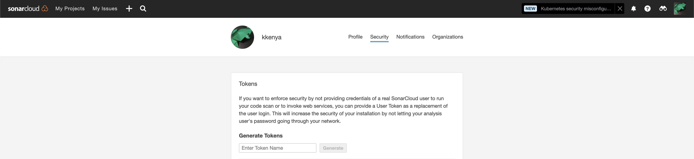

2. SCodeにトークンを設定

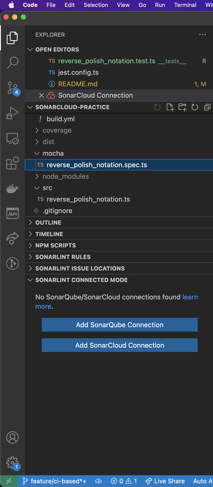

## Security Hotspotの修正について

httpのURLを許可したい場合など意図的にSecurity Hotspotの報告を修正しない場合はステータスを変更する（参考: [Security Hotspot Workflow](https://docs.sonarcloud.io/digging-deeper/security-hotspots/)）

スタータスの変更には `Administer Security Hotspots` の権限が必要になる。権限がないユーザーにはタブ自体が表示されない。

>Security hotspots have a dedicated lifecycle. To make status changes, the user needs the Administer Security Hotspots permission. This permission is enabled by default. Users with the Browse permission can comment on or change the user assigned to a security hotspot.

## 実装時のメモ

### jestの導入とテストカバレッジ

TypeScirptで[Jest](https://jestjs.io/docs/getting-started)を実行するため[ts-jest](https://kulshekhar.github.io/ts-jest/)を利用する。

```shell
npm install --save-dev jest ts-jest @types/jest
```

`@types/jest` のバージョンはjestに合わせる。
`jest` のバージョンが `28.1.0` なら `@types/jest` は `28.1.x` 。

設定ファイルの対話的な生成（ts-jestのセットアップスクリプト（ `npx ts-jest config:init` ）はjsで生成されるので利用しない）。

```shell
npx jest --init
```

`ts-jest` でTypeScriptの設定ファイルを利用する場合は `ts-node` のインストールが必要。

```shell
npm install --save-dev ts-node
```

`jest.config.ts` にpresetを指定

```js
  preset: "ts-jest",
```

カバレッジの計測には `coverage` オプションを指定する。

`package.json`

```js
"test": "jest --coverage"
```

カバレッジの集計対象からトランスパイルしたコードを除外する

`jest.config.ts`

```js
  coveragePathIgnorePatterns: ["/node_modules/", "dist"],
```

### ghコマンドでリポジトリを作成する

[`create`](https://cli.github.com/manual/gh_repo_create) のオプションに `--source` を指定することでローカルのディレクト名とコミット履歴で作成できる。

```shell
gh repo create --public --source=.
```

## 参考

- [Sonar](https://www.sonarsource.com/)
- [SonarCloud](https://docs.sonarcloud.io/)
