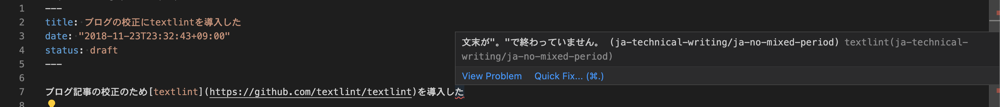

ブログ記事の校正のため[textlint](https://github.com/textlint/textlint)を導入した。

## 環境

```shell
% node -v
v14.17.6
% npm -v
6.14.15

```

## インストール

グローバルではなくプロジェクトで `devDependencies` を指定してインストール。

```shell
npm install --save-dev textlint
```

## ルールの追加

次のルールを利用。

- [textlint-rule-preset-JTF-style](https://github.com/textlint-ja/textlint-rule-preset-JTF-style)
- [textlint-rule-preset-ja-technical-writing](https://github.com/textlint-ja/textlint-rule-preset-ja-technical-writing)

```shell
npm install --save-dev textlint-rule-preset-ja-technical-writing textlint-rule-preset-jtf-style
```

設定ファイルを作成し、ルールを有効にする。
`.textlintrc` を作成し、[複数の拡張子](https://github.com/textlint/textlint/blob/master/docs/configuring.md)を扱える。
今回はyamlで記述するため、 `.textlintrc.yaml` を追加。

```yaml
rules:
  preset-jtf-style: true
  preset-ja-technical-writing: true
```

### [textlint-rule-preset-JTF-style](https://github.com/textlint-ja/textlint-rule-preset-JTF-style)

日本翻訳連盟（JTF）の日本語標準スタイルガイドを適用する。
句点 `。` ・読点 `、` 、記号の半角・全角や全角と半角の間のスペースなどを構成できる。

### [textlint-rule-preset-ja-technical-writing](https://github.com/textlint-ja/textlint-rule-preset-ja-technical-writing)

技術文書向けのプリセット。
一文字の長さからですます調、である調の統一や `することができる` どの冗長な表現を校正できる。

### [textlint-rule-spellcheck-tech-word](https://github.com/azu/textlint-rule-spellcheck-tech-word)

後述するProofdictに置き換えられるため、現在はメンテナンスされていない。

## textlintの実行

対象のファイル、ディレクトリを指定実行する。

```shell
% npx textlint content/blog/textlint/index.md

/Users/kkenya/work/github.com/kkenya/blog/content/blog/textlint/index.md
    7:64   error    文末が"。"で終わっていません。                                                                               ja-technical-writing/ja-no-mixed-period
   21:46   error    文末が"。"で終わっていません。                                                                               ja-technical-writing/ja-no-mixed-period
```

ブログ記事はvscodeでマークダウンを記述するため、都度コマンドを実行せず、拡張機能をインストールし、エディタにエラーを表示する。

- [vscode-textlint](https://marketplace.visualstudio.com/items?itemName=taichi.vscode-textlint)



## Proofdictによる表記揺れの校正

### [Proofdict](https://github.com/proofdict/proofdict)

辞書の管理ツール。
`JavaScript` という単語を辞書に追加することで `javascript` , `Java Script` のような表記揺れを検知できる。
[proofdict/proof-dictionary](https://github.com/proofdict/proof-dictionary)をフォークしGitHub Pagesで公開することにより自分の辞書を作成し、公開された辞書にGUIで単語を設定、編集が可能。

### Proofdictの利用

[ドキュメント](https://proofdict.github.io/docs/usage.html)に従い設定する
今回はあらかじめ定義済みであるazuさんの[azu.github.io/proof-dictionary](https://azu.github.io/proof-dictionary/)を利用させてもらった。

textlintから利用するためプラグインのインストール。

```shell
npm install --save-dev @proofdict/textlint-rule-proofdict
```

`.textlintrc.yaml` に利用する辞書を設定する。

[textlint-rule-proofdict](https://github.com/proofdict/proofdict/tree/master/packages/%40proofdict/textlint-rule-proofdict)を利用することでproofdictの辞書を `textlint` から利用できる。

```yaml
rules:
  # 省略...
  "@proofdict/proofdict":
    dictURL: "https://azu.github.io/proof-dictionary/"
```

## 参考

- [textlint](https://github.com/textlint/textlint)
- [proofdict/proof-dictionary](https://github.com/proofdict/proof-dictionary)
- [Proofdict を使って textlint の辞書管理を行う](https://zenn.dev/takasp/articles/0ef1645b118960)
