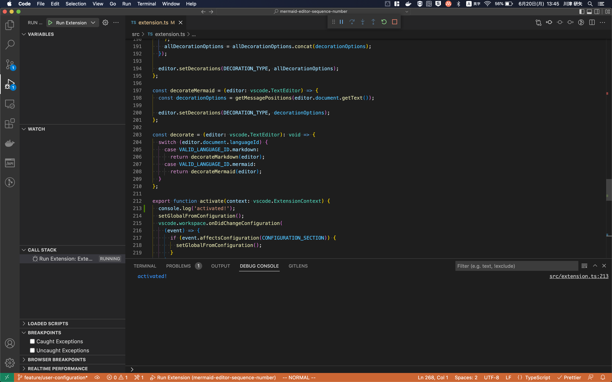

Visual Studio Code(以下vscode)の拡張機能開発はMicrosoftが提供するジェネレーターを利用して `TypeScript` で記述する

## プロジェクトの作成

拡張機能は[yoeman](https://github.com/yeoman/yo)を利用する
[GET STARTED](https://code.visualstudio.com/api/get-started/your-first-extension)に沿って雛形を生成

```shell
npm install --global yo generator-code
```

インストールしたgeneratorを利用して対話的に初期化を行う
vscode内で実行可能なコマンドや、エディタのカラーテーマ、言語のsyntax highlightなど雛形の種類を選択する

```shell
% yo code

     _-----_     ╭──────────────────────────╮
    |       |    │   Welcome to the Visual  │
    |--(o)--|    │   Studio Code Extension  │
   `---------´   │        generator!        │
    ( _´U`_ )    ╰──────────────────────────╯
    /___A___\   /
     |  ~  |
   __'.___.'__
 ´   `  |° ´ Y `

? What type of extension do you want to create? New Language Support
Enter the URL (http, https) or the file path of the tmLanguage grammar or press ENTER to start with a new grammar.
? URL or file to import, or none for new:
? What's the name of your extension? Abc lang
? What's the identifier of your extension? abc-lang
? What's the description of your extension? Syntax highlighting for abc lang
Enter the id of the language. The id is an identifier and is single, lower-case name such as 'php', 'javascript'
? Language id: abc
Enter the name of the language. The name will be shown in the VS Code editor mode selector.
? Language name: Abc
Enter the file extensions of the language. Use commas to separate multiple entries (e.g. .ruby, .rb)
? File extensions: .abc
Enter the root scope name of the grammar (e.g. source.ruby)
? Scope names: source.abc
? Initialize a git repository? Yes

Writing in ~/work/github.com/kkenya/abc-lang...
   create abc-lang/syntaxes/abc.tmLanguage.json
   create abc-lang/.vscode/launch.json
   create abc-lang/package.json
   create abc-lang/README.md
   create abc-lang/CHANGELOG.md
   create abc-lang/vsc-extension-quickstart.md
   create abc-lang/language-configuration.json
   create abc-lang/.vscodeignore
   create abc-lang/.gitignore
   create abc-lang/.gitattributes

Changes to package.json were detected.
Skipping package manager install.


Your extension abc-lang has been created!

To start editing with Visual Studio Code, use the following commands:

     code abc-lang

Open vsc-extension-quickstart.md inside the new extension for further instructions
on how to modify, test and publish your extension.

For more information, also visit http://code.visualstudio.com and follow us @code.


? Do you want to open the new folder with Visual Studio Code? Open with `code`
```

## 開発

`npm run watch` でソースコードの変更を監視して逐次トランスパイルを実行する

`F5` でデバッグを実行すると、Extention Development Hostという名前で新しいvscodeのwindowが開く
トランスパイルしたソースコードを、Extention Development Hostに反映させるのは `Cmd + R`(または　`Cmd  + Shift + P` でコマンドパレットを開いて `Developer: Reload Window` )を実行する
>>>>>>> adedc3c (wip)

デバッグを実行( `F5` )すると、Extention Development Hostという名前で新しいvscodeのウインドウが開く
ソースコードの変更を、Extention Development Hostに反映させるのは `Cmd + R` または　`Cmd  + Shift + P` でコマンドパレットを開いて `Developer: Reload Window` を実行しリロードする

### ログの出力

デバッグには基本的にステップ実行を利用して開発するが、`console.log` などでのプリントでバッグを行う場合DEBUG CONSOLE二出力される

例えば、拡張機能を有効化時に呼び出される `activate` 関数にログを追加する

```typescript
export function activate(context: vscode.ExtensionContext) {
  console.log('activated!');
  // ...
}
```

Extention Development Hostのウインドウをリロードすると、拡張機能開発側のウインドウでログを確認できる



## 公開

拡張機能を公開するには [vsce](https://github.com/microsoft/vscode-vsce)(Visual Studio Code Extention Manager)を利用する。

`vsce` のインストール

```shell
npm install -g vsce
```

vscodeのマーケットプレイスへの公開は Azure DevOptsで作成したPersonal Access Tokenを作成しておく必要がある

詳細は[ドキュメント](https://code.visualstudio.com/api/working-with-extensions/publishing-extension#get-a-personal-access-token)を参照

`package.json` に記述したpublisherでvsceにログインし、作成したPersonal Access Tokenを登録する

```shell
% vsce login kkenya
Publisher 'kkenya' is already known
Do you want to overwrite its PAT? [y/N] y
https://marketplace.visualstudio.com/manage/publishers/
Personal Access Token for publisher 'kkenya': ****************************************************

The Personal Access Token verification succeeded for the publisher 'kkenya'.
```

vsceでパッケージ化すると `拡張機能名-バージョン.vsix` でVSIXファイルが生成される
公開前にVSIXファイルから拡張機能をインストールし確認することも可能

```shell
vsce package
```

vscodeのマーケットプレイスに拡張機能を公開する

```shell
vsce publish
```

## 詰まった点

### サンプル実装

ユーザー設定やシンタックスハイライトなどのミニマムな実装は[サンプル集](https://github.com/microsoft/vscode-extension-samples)を参考にするといい

### extentionはextensionのタイポ

よく見かける

### Personal Access Tokenの有効期限が切れていた

Azure DevOptsで再度作成し、 `vsce login` を実行し再登録

```shell
 INFO  Publishing 'kkenya.mermaid-sequence-number v1.2.0'...
 ERROR  {"$id":"1","customProperties":{"Descriptor":null,"IdentityDisplayName":null,"Token":null,"RequestedPermissions":0,"NamespaceId":"00000000-0000-0000-0000-000000000000"},"innerException":null,"message":"Access Denied: The Personal Access Token used has expired.","typeName":"Microsoft.VisualStudio.Services.Security.AccessCheckException, Microsoft.VisualStudio.Services.WebApi","typeKey":"AccessCheckException","errorCode":0,"eventId":3000}

You're using an expired Personal Access Token, please get a new PAT.
More info: https://aka.ms/vscodepat
```

### エラーでデバッグのウインドウが起動しない

css単位
em
文字の高さを基準とした相対的な単位

[DecorationOptions](https://code.visualstudio.com/api/references/vscode-api#DecorationOptions)
renderOptions: [DecorationInstanceRenderOptions](https://code.visualstudio.com/api/references/vscode-api#DecorationInstanceRenderOptions)
パフォーマンスの理由からdecoration固有のオプションは最小にし、可能な限りdecoration typeを利用す る
after, beforeで指定した範囲の前、後どちらかの表示できる
dark, lightでテーマ切り替えできる

[TextEditorDecorationType](https://code.visualstudio.com/api/references/vscode-api#TextEditorDecorationType)
text editorで共通した装飾を提供する

[ThemableDecorationAttachmentRenderOptions](https://code.visualstudio.com/api/references/vscode-api#ThemableDecorationAttachmentRenderOptions)
装飾の描画オプション

## こまった

F5でデバッグ時にエラー
`Extension is not compatible with Code 1.65.2. Extension requires: ^1.66.0.`
起動し直したら直った
複数インスタンス起動していたからバージョンが同期できていなかっ?

### マーケットプレイスでREADMEの画像が表示できない

マーケットプレイスの画像はリポジトリを参照するので拡張機能をpublishしたが、リポジトリを更新していなかったため、取得元の画像が存在せず表示できなかった

### vsce packageでエラーになる

画像をgitignoreの対象にしていて、パッケージ作成時に画像をバンドルできずエラーになった

### 困った

変更が反映されない
typescriptで開発しているので、javascriptに都度トランスパイルする必要がある
`npm run compile` または `npm run watch` で変更を監視しましょう

アイコンについて
背景について

画像をgitignoreの対象にしていて、パッケージ作成時に画像をバンドルできずエラーになった

正規表現で遅くなった

処理を実行するイベントについて
テキストを開いた時に反映されない

windowとworkspaceについて

Eventの引数について
https://code.visualstudio.com/api/references/vscode-api#EvaluatableExpressionProvider

Event
イベントを購読するリスナーを登録する
lisner リスナーはイベントが発火した際に呼ばれる
thisArgs イベントリスナーを呼び出した際に利用される
disposables disposableが追加されるdisposableの配列
返り値 disposable

dispose 意味　廃棄

Disposable
イベントリスナーやタイマーのようなリソースを解放できるtypeを提供する

## 参考

- [GET STARTED](https://code.visualstudio.com/api/get-started/your-first-extension)
- [microsoft/vscode-extension-samples](https://github.com/microsoft/vscode-extension-samples)
## publish

対話的にパッケージを生成
設定していない項目があれば、わかる

```shell
npm install -g vsce
vsce package
```
  
```shell
s06540@CA-20007798[~/work/github.com/kkenya/mermaid-sequential-number] (main) % vsce package
Executing prepublish script 'npm run vscode:prepublish'...

> mermaid-sequential-number@0.0.1 vscode:prepublish /Users/s06540/work/github.com/kkenya/mermaid-sequential-number
> npm run package


> mermaid-sequential-number@0.0.1 package /Users/s06540/work/github.com/kkenya/mermaid-sequential-number
> webpack --mode production --devtool hidden-source-map

    [webpack-cli] Compiler starting...
    [webpack-cli] Compiler is using config: '/Users/s06540/work/github.com/kkenya/mermaid-sequential-number/webpack.config.js'
    [webpack-cli] Compiler finished
asset extension.js 83.2 KiB [compared for emit] [minimized] (name: main) 1 related asset
orphan modules 230 KiB [orphan] 53 modules
runtime modules 670 bytes 3 modules
built modules 234 KiB [built]
  ./src/extension.ts 4.21 KiB [built] [code generated]
  ./node_modules/mdast-util-from-markdown/index.js + 52 modules 230 KiB [built] [code generated]
  external "vscode" 42 bytes [built] [code generated]
webpack 5.71.0 compiled successfully in 3093 ms
 WARNING  A 'repository' field is missing from the 'package.json' manifest file.
Do you want to continue? [y/N] y
 DONE  Packaged: /Users/s06540/work/github.com/kkenya/mermaid-sequential-number/mermaid-sequential-number-0.0.1.vsix (7 files, 30.67KB)
```

https://code.visualstudio.com/api/working-with-extensions/publishing-extension
## 参考

- https://engineering.linecorp.com/ja/blog/uit-enhancement-vscode/
- https://vscode.rocks/decorations/

- https://vscode.rocks/decorations/

package.jsonの設定
https://code.visualstudio.com/api/references/extension-manifest

changelogについて

日本語版
https://keepachangelog.com/ja/1.0.0/

## 帰り値

Not all code paths return a value.ts(7030)

{} | voidならOK
{} | undefinedは失敗

## 正規表現

trimLeft
trimRightのせいの脳が悪い
正規表現の方が早かっただと

/^\s* は重くて、 \s*$ は早い?
どっちも重いわ

## publish

マイクロソフトアカウントでログイン

https://docs.microsoft.com/azure/devops/organizations/accounts/create-organization

Azure DevOpsでorganizationの作成
projectの作成を案内されるが不要
personal access tokenの作成に進む
documentに従って設定
Name: vscode入力
Organization: All accessible organizationsに変更
Expiration: 30daysのまま
Scopes: 
  Custom definedを選択
  デフォルトでは表示されないので　Show all scopesを選択
  MarketplaceでManage選択
wuuabi2dg6cnffkalipaje4zexgafa42u6rmjvkkq2vh7brxeira

personal access tokenは再度確認することができないのでパスワードマネージャーなどに保存しておく

自分はサインインしたままになっていた
Personal Access Tokenを作成したアカウントでVS CodeのMarketplace [managment page](https://marketplace.visualstudio.com/manage/publishers/kkenya)にログイン

cliからpersonal access tokenを設定する
vsce login kkenya
または
vsce publish
を実行し、webpackでのコンパイル後pe、rsonal access tokenを設定できる

```shell
s06540@CA-20007798[~/work/github.com/kkenya/mermaid-editor-sequence-number] (main) % vsce publish
Executing prepublish script 'npm run vscode:prepublish'...

> mermaid-sequence-number@0.0.1 vscode:prepublish
> npm run package


> mermaid-sequence-number@0.0.1 package
> webpack --mode production --devtool hidden-source-map

    [webpack-cli] Compiler starting...
    [webpack-cli] Compiler is using config: '/Users/s06540/work/github.com/kkenya/mermaid-editor-sequence-number/webpack.config.js'
    [webpack-cli] Compiler finished
asset extension.js 83.8 KiB [compared for emit] [minimized] (name: main) 1 related asset
orphan modules 230 KiB [orphan] 53 modules
runtime modules 670 bytes 3 modules
built modules 235 KiB [built]
  ./src/extension.ts 5.39 KiB [built] [code generated]
  ./node_modules/mdast-util-from-markdown/index.js + 52 modules 230 KiB [built] [code generated]
  external "vscode" 42 bytes [built] [code generated]
webpack 5.71.0 compiled successfully in 2731 ms
https://marketplace.visualstudio.com/manage/publishers/
Personal Access Token for publisher 'kkenya': %
s06540@CA-20007798[~/work/github.com/kkenya/mermaid-editor-sequence-number] (main) % vsce publish
Executing prepublish script 'npm run vscode:prepublish'...

> mermaid-sequence-number@0.0.1 vscode:prepublish
> npm run package


> mermaid-sequence-number@0.0.1 package
> webpack --mode production --devtool hidden-source-map

    [webpack-cli] Compiler starting...
    [webpack-cli] Compiler is using config: '/Users/s06540/work/github.com/kkenya/mermaid-editor-sequence-number/webpack.config.js'
    [webpack-cli] Compiler finished
asset extension.js 83.8 KiB [compared for emit] [minimized] (name: main) 1 related asset
orphan modules 230 KiB [orphan] 53 modules
runtime modules 670 bytes 3 modules
built modules 235 KiB [built]
  ./src/extension.ts 5.39 KiB [built] [code generated]
  ./node_modules/mdast-util-from-markdown/index.js + 52 modules 230 KiB [built] [code generated]
  external "vscode" 42 bytes [built] [code generated]
webpack 5.71.0 compiled successfully in 2999 ms
https://marketplace.visualstudio.com/manage/publishers/
Personal Access Token for publisher 'kkenya': ****************************************************

The Personal Access Token verification succeeded for the publisher 'kkenya'.
 INFO  Publishing 'kkenya.mermaid-sequence-number v0.0.1'...
 INFO  Extension URL (might take a few minutes): https://marketplace.visualstudio.com/items?itemName=kkenya.mermaid-sequence-number
 INFO  Hub URL: https://marketplace.visualstudio.com/manage/publishers/kkenya/extensions/mermaid-sequence-number/hub
 DONE  Published kkenya.mermaid-sequence-number v0.0.1.
```

https://code.visualstudio.com/api/working-with-extensions/bundling-extension

iconが設定できなかった
vscodeignoreにreadmeようでimageディレクトリを指定していたので、images/icon.pngを含められなかった
https://stackoverflow.com/questions/44423212/error-detecting-icon-when-publishing-vscode-extension

```
 ERROR  The specified icon 'extension/./images/icon.png' wasn't found in the extension.
```
